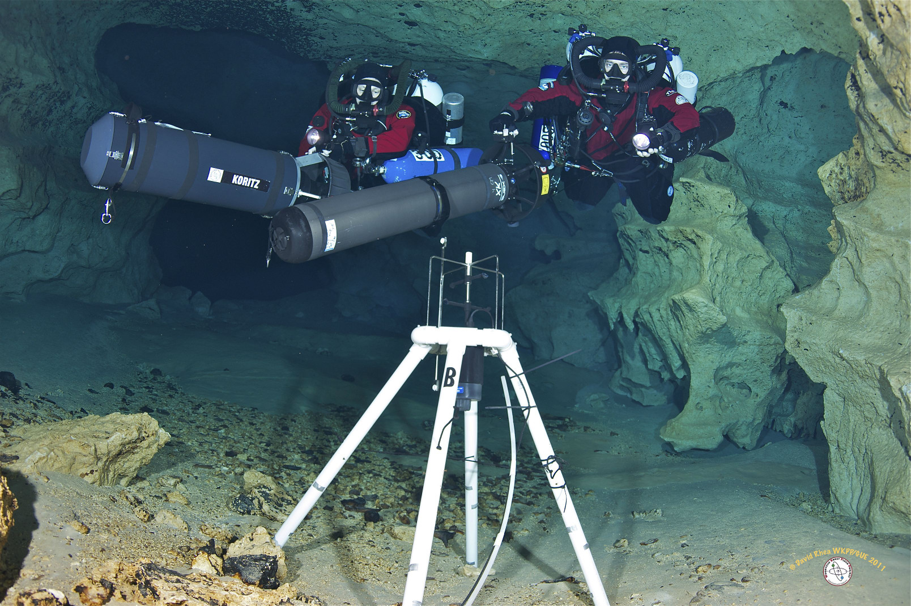

```{r connect, include=FALSE}
#Behind the scenes database connection parameters
library(RPostgreSQL)
db_connection <- dbConnect(PostgreSQL(), db='wkp_hrdb', host='fgs-usrv', user='postgres', password='incorrectLitho')
```

```{r global_options, include=FALSE}
#knitr global options
knitr::opts_chunk$set(fig.width=12, fig.height=8,
                      echo=FALSE, warning=FALSE, message=FALSE)
```

# General Introduction  
  
The Falmouth 2D-ACM meters, aka the FGS deep sensor network, were originally installed 2003 and mark the genesis of the Florida Geological Survey's Woodville Karst Plain Instrumentation Project (the history of this project [is documented here](https://github.com/FloridaGeologicalSurvey/KORI/wiki/Project-History)). These meters have been installed at approximately 300 feet below the surface of the water table, in a variety of karst conduits that are responsible for supplying Wakulla Spring with water.

The 2D-ACM units utilized by the FGS in the deep sensor network are manufactured by [Falmouth Scientific, Inc.](http://www.falmouth.com/) of Cataumet, Massachusetts. They were installed in the conduit network by the volunteers of the [Woodville Karst Plain Project (WKPP)](https://www.globalunderwaterexplorers.org/Projects/WKPP). The 2D-ACM meters are located in extremely remote and inaccessible locations that require the technical expertise of the WKPP divers in order to install and maintain. Access to these locations is controlled by the prevailing water conditions in the conduits and the availability of divers, and during some periods meters been deployed "in the hole" for long intervals without servicing.  

This statistical atlas is intended to familiarize the reader with the statistical properties of the B meter data.

# Meter and Conduit Summary



__Falmouth 2D-ACM deployed in B Tunnel. Image Copyright David Rhea 2011__  
  
# Getting the Data
To get the data for the B conduit, we execute an SQL statement against the database, qualified by a WHERE cause.
```{r get, echo=TRUE}
library(RPostgreSQL)
#db_connection <- dbConnect(PostgreSQL(), db='yourdatabase', host='yourhost', user='youruser', password='yourpassword')
fal <- dbGetQuery(db_connection, "SELECT * FROM rfalmouth WHERE site_name = \'B (Deep)\' ORDER BY date_time, var;")
```
For the purposes of this analysis, the resulting table was dumped into a csv file using:
  
#Data Overview 

A basic view of the data returned by the database:
```{r head}
library(pander)
panderOptions("table.split.table", Inf)
pander(head(fal))
```
  

Summary of data values:
```{r b_summary}
ag <- aggregate(val ~ var, fal, summary)
ag.summary <- cbind(ag$var, 
                     as.data.frame(ag$val))
names(ag.summary)[1] <- "statistic"
pander(t(ag.summary))
```
  
The date range of this meter's data: 
```{r, echo=FALSE}
min(fal$date_time)
max(fal$date_time)
```
  
```{r lubridate}
library(lubridate)
fal$year <- year(fal$date_time)
fal$yearmo <- format(fal$date_time, "%Y-%m")
fal$month <- format(fal$date_time, "%b")
```

## Deployments  
  
B meter is one of the longest serving meters and was only deployed once in 2003. This sensor remained on station until December of 2013 when it was replaced. 
```{r deployments}
deploy = dbGetQuery(db_connection, "SELECT s.site_name, d.deploy_key, d.serial_number, d.start_dt, d.end_dt, d.active FROM deploy_info d INNER JOIN sites s USING (site_id) WHERE s.site_name = \'B (Deep)\';")
names(deploy) <- c("Site Name","Database Deploy Key","Serial Number","Start","End","Currently Active")
pander(deploy)
```
  
## Average Speed  
  
### Excluded Values  
No values have been excluded from the following summaries. 
  
### Statistical Summary  
  
```{r summary_aspd}
aspd <- fal[fal$var=="aspd",]
pander(summary(aspd$val))
```
  
### ASPD Plots 
  
There are no known problems with the average speed values in this data.
```{r density_aspd}
library(ggplot2)
library(gridExtra)
library(scales)
library(ggthemes)

bplot <- ggplot(aspd, aes(x=val))
bplot + 
  theme_bw() +
  geom_density(fill="indianred", alpha=1/4) +
  labs(x="Average Speed (cm/s)", y="Density") +
  ggtitle("ASPD Density")
```
  
```{r boxplot_aspd, fig.width=12, fig.height=8}
tplot <- ggplot(aspd, aes(x=yearmo, y=val, group = yearmo))
tplot +
  theme_gray() +
  geom_boxplot(outlier.size = 0.75, size = 0.25, weight=0.25) +
  theme(legend.position="bottom", 
        axis.text.x = element_text(angle=90, size=7, vjust= 0.5), 
        axis.text.y = element_text(size=10), 
        plot.title = element_text(face="bold", size=24)) +
  ggtitle("B Conduit\nAverage Speed of Flow") +
  ylab("Average Speed (cm/s)") +
  xlab("Month and Year")
```
  
## Conductivity  
  
  
### Excluded Values
Note: Values above 10 mmho have been excluded using the following slice: `{r}fal[fal$var=="cond" & fal$val > 10,]`. The frequency and pattern of these high values are assumed to be a malfunciton of the 2D-ACM unit and not true values.   
  
```{r excluded_conductivity}
badvals <- fal[fal$var=="cond" & fal$val > 10,]
rownames(badvals) <- NULL
pander(badvals)
cond <- fal[fal$var=="cond" & fal$val < 10,]
```
  
### Statistical Summary
```{r summarize_cond}
pander(summary(cond$val))
```
  
### COND Plots  
  
```{r density_cond}
bplot <- ggplot(cond, aes(x=val))
bplot + 
  theme_bw() +
  geom_density(fill="royalblue", alpha=1/4) +
  labs(x="Conductivity (mmho)", y="Density") +
  ggtitle("COND Density")
```
```{r boxplot_cond, fig.width=12, fig.height=8}
tplot <- ggplot(cond, aes(x=yearmo, y=val, group = yearmo))
tplot +
  theme_gray() +
  geom_boxplot(outlier.size = 0.75, size = 0.25, weight=0.25) +
  theme(legend.position="bottom", 
        axis.text.x = element_text(angle=90, size=7, vjust= 0.5), 
        axis.text.y = element_text(size=10), 
        plot.title = element_text(face="bold", size=24)) +
  ggtitle("B Conduit\nConductivity") +
  ylab("Conductivity (mmho)") +
  xlab("Month and Year")
```
  

## Temperature  
All of the Falmouth 2D-ACM temperature sensors show a marked decline in temperature readings over time caused by the temperature transducer in the unit failing. No temperature values from the any Falmouth 2D-ACM should be trusted or used for analysis without rigorous quality checks and comparisons to other data sources that are known to be valid.  

### Excluded Values
Note: Values below 19 C have been excluded using the following slice: `{r} fal[fal$var=="temp" & fal$val < 20,]`. The frequency and pattern of these high values are assumed to be a malfunciton of the 2D-ACM unit and not true values. 
  
```{r excluded_temp}
badvals <- fal[fal$var=="temp" & fal$val < 20,]
temp <- fal[fal$var=="temp" & fal$val > 20,]
rownames(badvals) <- NULL
pander(badvals)
```
  
### Statistical Summary
```{r temp_summary}
pander(summary(temp$val))
```  
  
### TEMP Plots
```{r density_temp}
bplot <- ggplot(temp, aes(x=val))
bplot + 
  theme_bw() +
  geom_density(fill="seagreen", alpha=1/4) +
  labs(x="Temperature (C)", y="Density") +
  ggtitle("TEMP Density")

```

```{r boxplot_temp, fig.width=12, fig.height=8}
tplot <- ggplot(temp, aes(x=yearmo, y=val, group = yearmo))
tplot +
  theme_gray() +
  geom_boxplot(outlier.size = 0.75, size = 0.25, weight=0.25) +
  theme(legend.position="bottom", 
        axis.text.x = element_text(angle=90, size=7, vjust= 0.5), 
        axis.text.y = element_text(size=10), 
        plot.title = element_text(face="bold", size=24)) +
  ggtitle("B Conduit\nTemperature") +
  ylab("Temperature (C)") +
  xlab("Month and Year")
```

## Pressure  
All of the Falmouth 2D-ACM pressure sensors show a marked decline in pressure readings over time caused by the pressure transducer in the unit failing. No pressure values from the any Falmouth 2D-ACM should be trusted or used for analysis without rigorous quality checks and comparisons to other data sources that are known to be valid.  
  
### Excluded Values  
A single reading of pres==0 for this conduit has been excluded from the following analysis using this slice in R: `{r}badvals <- fal[fal$var=="pres" & fal$val < 10,]`.

```{r excluded_pressure}
badvals <- fal[fal$var=="pres" & fal$val < 10,]
pres <- fal[fal$var=="pres" & fal$val > 10,]
rownames(badvals) <- NULL
pander(badvals)
```
  
### Statistical Summary  
```{r pres_summary}
pander(summary(pres$val))
```  
  
### PRES Plots  
```{r density_pres}
bplot <- ggplot(pres, aes(x=val))
bplot + 
  theme_bw() +
  geom_density(fill="goldenrod", alpha=1/4) +
  labs(x="Pressure (dbar)", y="Density") +
  ggtitle("PRES Density")

```

```{r boxplot_pres, fig.width=12, fig.height=8}
tplot <- ggplot(pres, aes(x=yearmo, y=val, group = yearmo))
tplot +
  theme_gray() +
  geom_boxplot(outlier.size = 0.75, size = 0.25, weight=0.25) +
  theme(legend.position="bottom", 
        axis.text.x = element_text(angle=90, size=7, vjust= 0.5), 
        axis.text.y = element_text(size=10), 
        plot.title = element_text(face="bold", size=24)) +
  ggtitle("B Conduit\nPressure") +
  ylab("Pressure (dbar)") +
  xlab("Month and Year")
```
  
## Average Direction  
Note that average direction values must be handled differently due to the topological differences in the structure of the underlying data. Directional data lies on a circle, not on a number line, so any and all statistical analyses must take this into account.  
  
### Excluded Values  
```{r excluded_avdir}
avdir <- fal[fal$var=="avdir",]
```

### Statistical Summary  
```{r avdir_summary}
pander(summary(avdir$val))
```  
  
### AVDIR Plots  
```{r density_avdir}
bplot <- ggplot(avdir, aes(x=val))
bplot + 
  theme_bw() +
  geom_density(fill="darkorchid", alpha=1/4) +
  labs(x="Average Direction (degrees)", y="Density") +
  ggtitle("AVDIR Density")

```

```{r avdir_polar}
p <- ggplot(avdir, aes(x=val))
p + 
  geom_bar(binwidth=1, fill = "white",colour="grey90", weight=0.25, alpha=1) + 
  coord_polar() +
  labs(x="Direction", y="Count of Observations") + 
  ggtitle("Directional Plot of AVDIR")
```

